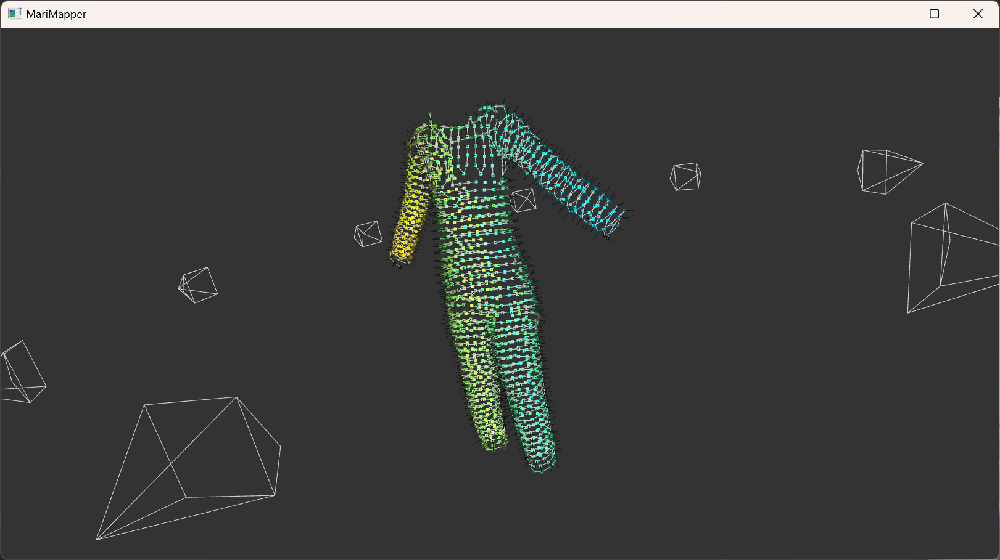
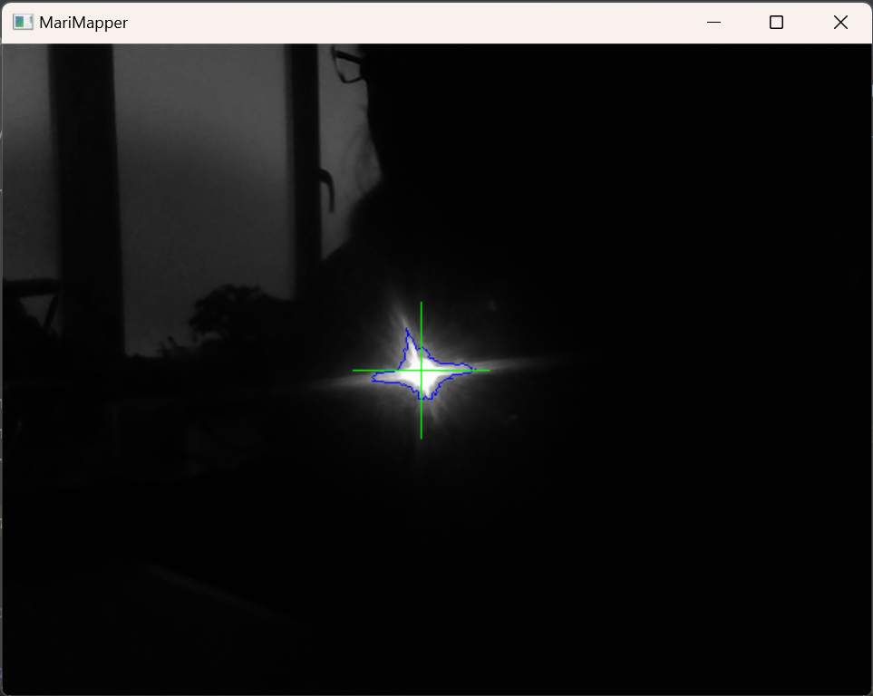
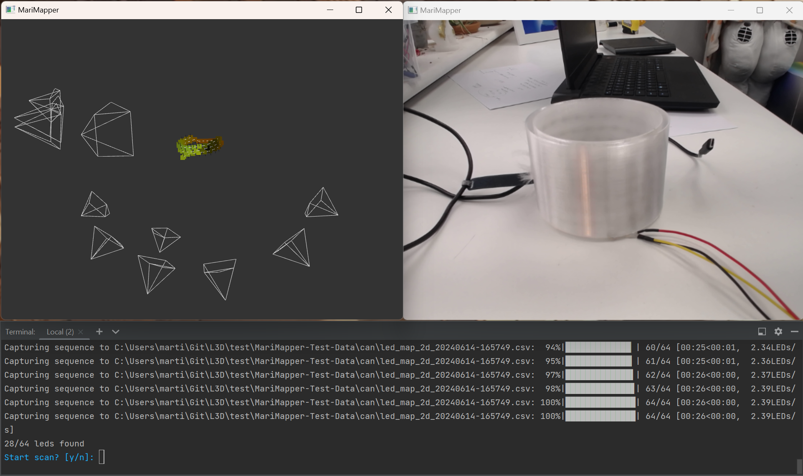

[]()
[](https://github.com/TheMariday/MariMapper/actions/workflows/test_windows.yml)
[](https://github.com/TheMariday/MariMapper/actions/workflows/test_ubuntu.yml)
[](https://github.com/TheMariday/MariMapper/actions/workflows/test_mac.yml)
[](https://github.com/psf/black)

This is a tool to map addressable LEDs into 2D and 3D space using only your webcam!

The basic algorithms behind this is what I used to map [Highbeam](https://www.youtube.com/shorts/isdhMqDIR8k)
(Map pictured below)




## Step 0: Install requirements

After downloading this repository and installing Python, run `pip install -r requirements.txt`

## Step 1: Run the camera checker (recommended)

Run `python scripts/check_camera.py` to ensure your camera is compatible with MariMapper, or check the list below:

<details>

<summary>Working Cameras</summary>

- HP 4310 (settings may not revert)
- Logitech C920
- Dell Lattitude 5521 built-in
- HP Envy x360 built-in 
- If your camera works, please drop me a line so I can add it to the list!

</details>

Test LED identification by turning down the lights and holding a torch or led up to the camera
This should start with few warnings, no errors and produce a **very** dark image
with a single crosshair on centered on your LED.

As long as your webcam has exposure control, this should even work in a relatively well lit room!




> [!TIP]
> If your camera doesn't support exposure adjustment, or the image is still too bright, try dimming the lights and playing around with the --exposure and --threshold arguments

## Step 2: Choose / Write your LED backend

MariMapper needs to be able to communicate with your LEDs and it does this via a `--backend`

MariMapper support the following pre-made backends:

- `fadecandy`
- [`wled`](https://kno.wled.ge/)
- [`fcmega`](https://github.com/TheMariday/FC-Mega)
- `custom`

If you choose a pre-built backend, remember to install its dependencies using 
`pip install -r backends/fadecandy/requirements.txt`

However, your LEDs are as unique as you are,
so it's super simple to implemenet your own `custom` backend by filling in the blanks
in [backends/custom/custom_backend.py](backends/custom/custom_backend.py):

```python
# import some_led_library

class Backend:

    def __init__(self):
        # connect to some device here!

    def get_led_count(self):
        # return the number of leds your system can control here

    def set_led(self, led_index: int, on: bool):
        # Write your code for controlling your LEDs here
        # It should turn on or off the led at the led_index depending on the "on" variable
        # For example:
        # if on:
        #     some_led_library.set_led(led_index, (255, 255, 255))
        # else:
        #     some_led_library.set_led(led_index, (0, 0, 0))
```
> [!TIP]
> You can test your backend with `python scripts/check_backend.py`

## Step 3: [It's time to thunderize!](https://youtu.be/-5KJiHc3Nuc?t=121)

Run `python marimapper.py my_scan --backend fadecandy` 

change `fadecandy` to whatever backend you're using 
and `my_scan` to the directory you want to save your scan

Set up your LEDs so most of them are in view and when you're ready, type `y` when prompted with `Start scan? [y/n]`

This will turn each LED on and off in turn, do not move the camera or leds during capture!

If you just want a 2D map, this is where you can stop! 

Run `python scripts/view_2d_map.py my_scan/...` to visualise your map replacing `...` with the map name.

To capture a 3D map, rotate your leds or move your webcam to a new position

> [!TIP]
> As long as some of your leds are mostly in view, you can move your webcam to wherever you like!
> Try and get at least 3 views between 6° - 20° apart

Once you have at least 2 2d maps, a new window will appear showing the reconstructed 3D positions of your LEDs.

If it doesn't look quite right, add some more scans!

Here is an example reconstruction of a test tube of LEDs I have



<details>
<summary>How to move the model around</summary>

- Click and drag to rotate the model around. 
- Hold shift to roll the camera
- Use the scroll wheel to zoom in / out
- Use the `n` key to hide / show normals
- Use the `+` / `-` keys to increase / decrease point sizes
- Use `1`, `2` & `3` keys to change colour scheme
</details>

# Feedback

I would really love to hear what you think and if you have any bugs or improvements, please raise them here or drop me a
line on [Telegram](https://t.me/themariday).

You can also raise issues [on this repo's issues page](https://github.com/TheMariday/marimapper/issues)

If you implement a backend that you think others might use, 
please raise a [pull request](https://github.com/TheMariday/marimapper/pulls) 
or just drop me a message on [Telegram](https://t.me/themariday)!

# Licensing

The licensing on this is [GPLv3](LICENSE).

The TLDR is you can do anything you like as long as you let users know that this repo exists.

I basically want to avoid someone packaging this up, selling it and telling people that it's the only way to do this.
